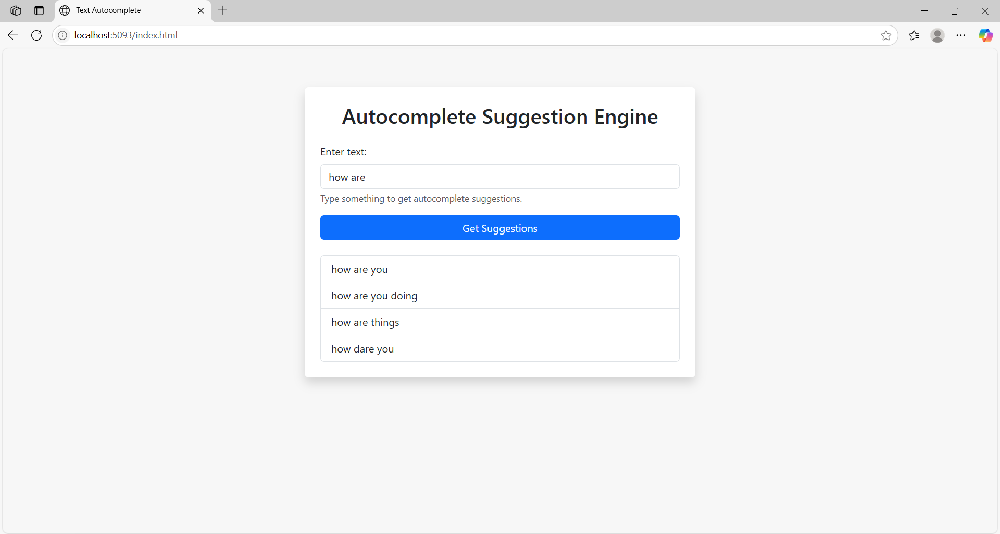

🧠 Text Auto-Complete API

A simple ASP.NET Core Web API that accepts user input and returns auto-complete suggestions using a third-party NLP service (Datamuse API).

---

## 🚀 How to Run

1. **Build the project**
2. Open **View → Terminal** and run the following commands:
    ```bash
    cd TextAutoCompleteAPI
    set ASPNETCORE_Environment=Development
    dotnet run
    ```
3. After running, go to: [http://localhost:5093/index.html](http://localhost:5093/index.html)

---

## API Documentation

The API uses Swagger for documenting and testing the endpoints.

### Accessing Swagger UI

Once the application is running, navigate to the following URL in your browser:

```
http://localhost:5093/swagger
```

This interface provides detailed information on available API endpoints, required request formats, and example responses.

### API Endpoints

#### `POST /api/auto`

This endpoint accepts a JSON payload with a user input string and returns a list of autocomplete suggestions.

**Request Body:**
```json
{
  "input": "how are"
}
```

**Response:**
```json
{
  "suggestions": [
    "you",
    "you doing",
    "you today",
    ...
  ]
}
```

- The endpoint includes input validation (minimum 3 characters, maximum 100 characters).
- Suggestions are retrieved from the Datamuse API and optionally cached.


## 🧩 Key Design Choices

### 🔹 Layered Architecture

- **Controller Layer**:  
  Handles HTTP requests from the client (e.g., `AutoCompleteController`). Validates the request model and delegates business logic to the service layer.

- **Service Layer**:  
  Encapsulates the business logic. `AutoCompleteServiceAPI` communicates with an external API (e.g., Datamuse) and generates the suggestions for the user prompt. .

- **Model Layer**:  
  Contains data structures such as `AutoComplete` (for request validation) and `Response` (for deserializing third-party API responses).

> This architecture promotes **separation of concerns**, making the application easier to maintain, extend, and test.

### 🔹 Interfaces for Dependency Injection

- **IAutoCompleteService**:  
  Defines the contract for the auto-complete suggestion service. Implemented by `AutoCompleteServiceAPI`.  
  ✅ Allows for easy testing, mocking, and swapping of service implementations.

- **ILoggerService**:  
  Provides a standard way to log API usage and validation results to a file.  
  ✅ Abstracting logging allows you to switch between different logging targets (file, database, cloud, etc.) without changing business logic. Logs folder will be created in current working directory. 

> Interfaces help with **loose coupling** and **testability**, which are key principles in clean software design.

### 🔹 Asynchronous Programming

- All key methods use **`async`/`await`** and return **`Task<T>`**. For example:  
  ```csharp
  public async Task<List<string>> GetSuggestions(AutoComplete auto)
  ```

- Asynchronous code ensures:
  - ✅ **Non-blocking operations**, especially important when calling external APIs.
  - ✅ **Better performance and scalability**, as the application can handle more requests simultaneously without locking threads.

> Using `async/await` with `Task` improves **responsiveness** and **resource efficiency**, especially in web APIs.

---

## Sample UI Output




